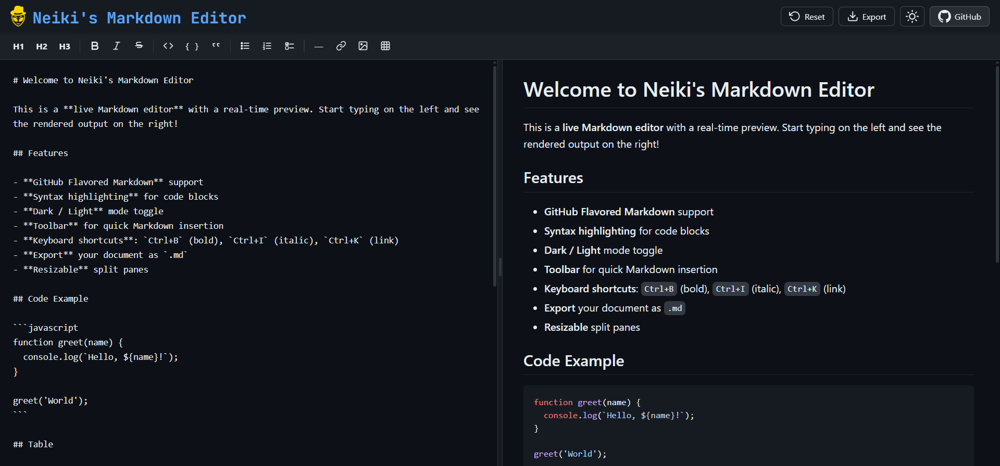

<p align="center">
  
</p>

<h1 align="center">Neiki's Markdown Editor</h1>

<p align="center">
  
  
  
  <br>
  
  
</p>

<p align="center">
  <b>Live Markdown Editor & Viewer</b><br>
  <i>Write Markdown on the left, see a beautiful GitHub-styled preview on the right — instantly in the browser.</i>
</p>

<p align="center">
  
  
  
  
</p>

---



---

**Live version:** [https://neiki.eu/markdown-editor](https://neiki.eu/markdown-editor)

---

## ✨ Features

- **Real-time preview** — Markdown renders instantly as you type
- **GitHub Flavored Markdown** — tables, task lists, strikethrough and more
- **Syntax highlighting** — code blocks with language-aware highlighting via Highlight.js
- **Dark / Light mode** — toggle between themes with a single click, preference is saved
- **Toolbar** — quick-insert buttons for headings, bold, italic, code, links, images, tables and more
- **Keyboard shortcuts** — `Ctrl+B` (bold), `Ctrl+I` (italic), `Ctrl+K` (link), `Ctrl+E` (inline code)
- **Export** — download your document as a `.md` file
- **Resizable split panes** — drag the divider to adjust editor / preview ratio
- **Mobile-friendly** — tab switcher for editor and preview on small screens
- **XSS-safe** — all output is sanitized with DOMPurify

---

## 🚀 Getting Started

No build step required. Simply open `index.html` in your browser.

```
git clone https://github.com/neikiri/neiki-markdown-editor.git
cd neiki-markdown-editor
open index.html
```

All dependencies are loaded from CDN — no `npm install` needed.

---

## 🛠️ Tech Stack

| Technology | Purpose |
| ---------- | ------- |
| [markdown-it](https://github.com/markdown-it/markdown-it) | Markdown parsing |
| [Highlight.js](https://highlightjs.org/) | Syntax highlighting |
| [github-markdown-css](https://github.com/sindresorhus/github-markdown-css) | GitHub-styled preview |
| [DOMPurify](https://github.com/cure53/DOMPurify) | HTML sanitization |

---

## 📄 License

This project is licensed under the **MIT License** — see the [LICENSE](LICENSE) file for details.

---

## 👨‍💻 Author

**neikiri**
GitHub: https://github.com/neikiri

---

## 📬 Contact

📧 Email: dev@neiki.eu
